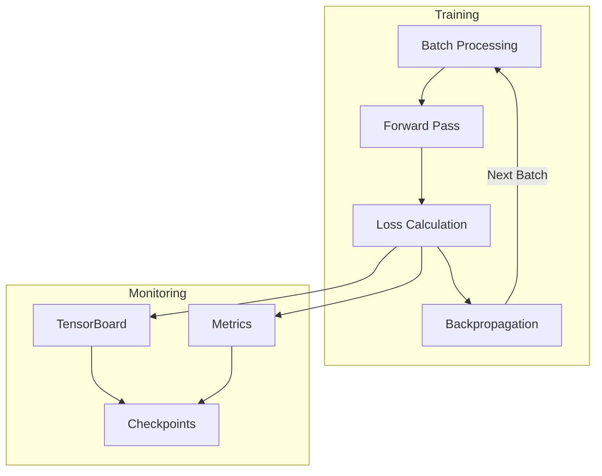
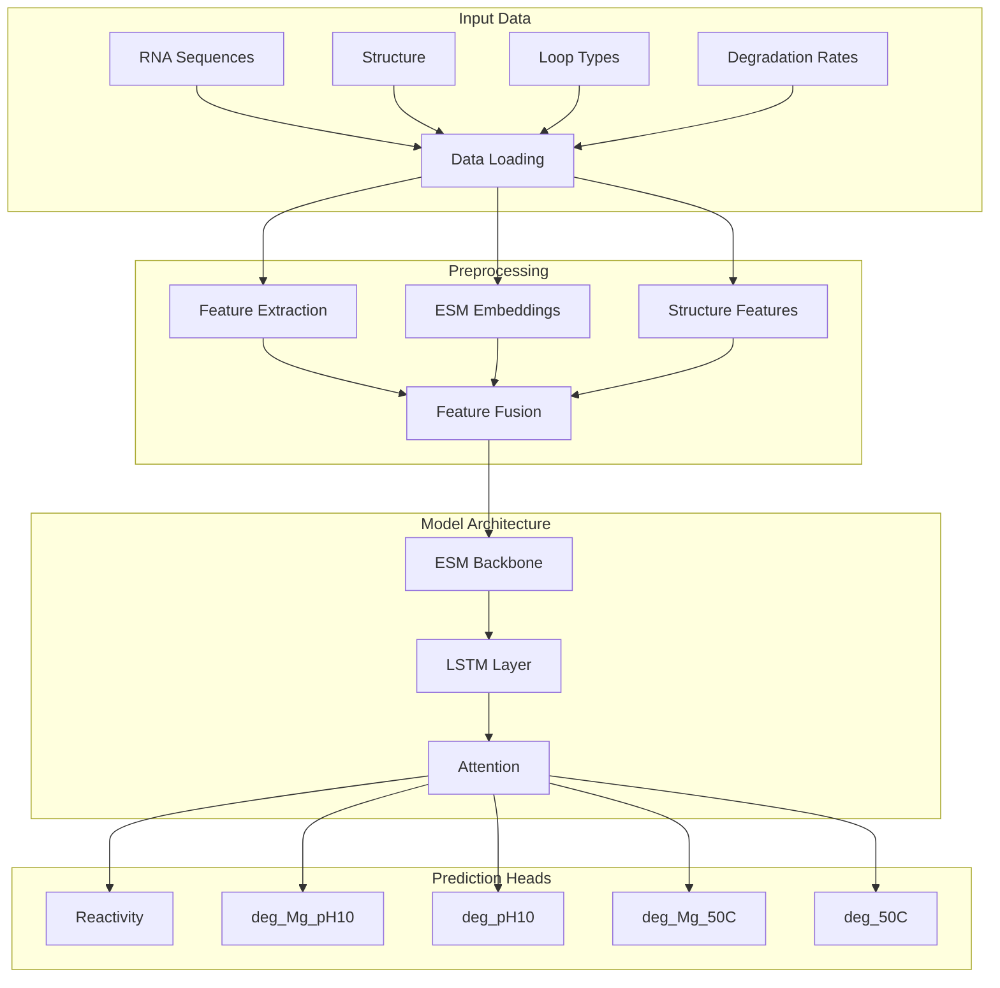

# RNA Structure Prediction Project

## Project Overview
This project implements RNA structure prediction using ESM (Evolutionary Scale Modeling) with few-shot learning capabilities. It analyzes RNA sequences and predicts their structural properties under various degradation conditions.

## Workflow





## Directory Structure
```
rna_analysis/
├── data/                      # Data directory
│   ├── embeddings/           # Pre-computed ESM embeddings
│   ├── processed/            # Processed data files
│   └── raw/                  # Raw data files
│       ├── bpps/             # Base pair probability matrices
│       ├── post_deadline_files/
│       ├── sample_submission.csv
│       ├── test.csv
│       ├── test.json
│       ├── train.csv
│       └── train.json
├── src/                      # Source code
│   ├── data/                 # Data processing modules
│   │   ├── __init__.py
│   │   ├── preprocessing.py  # Data preprocessing functions
│   │   └── loader.py        # Data loading utilities
│   ├── models/              # Model implementations
│   │   ├── __init__.py
│   │   ├── esm_model.py    # ESM model architecture
│   │   ├── few_shot.py     # Few-shot learning implementation
│   │   └── metrics.py      # Model evaluation metrics
│   ├── training/           # Training utilities
│   │   ├── __init__.py
│   │   ├── trainer.py      # Training loop implementation
│   │   └── config.py       # Training configurations
│   ├── visualization/      # Visualization tools
│   │   ├── __init__.py
│   │   └── visualizer.py   # Plotting and TensorBoard utils
│   └── notebooks/          # Jupyter notebooks
│       ├── 01_data_exploration.ipynb
│       └── 02_model_development.ipynb
│
├── configs/               # Configuration files
│   ├── default.yaml
│   └── few_shot.yaml
├── tests/                # Unit tests
│   ├── __init__.py
│   ├── test_preprocessing.py
│   └── test_model.py
├── scripts/              # Utility scripts
│   ├── train.sh
│   └── prepare_data.sh
├── runs/                 # Experiment runs
│   └── tensorboard/     # TensorBoard logs
├── requirements.txt     # Project dependencies
├── setup.py            # Package setup file
└── README.md           # Project documentation
```

## Installation
```bash
# Create conda environment
conda create -n rna_env python=3.10
conda activate rna_env

# Install dependencies
pip install -e .
```

## Usage

### 1. Data Preparation
```bash
# Prepare raw data
python scripts/prepare_data.sh

# Generate ESM embeddings
python src/data/preprocessing.py --input data/raw --output data/embeddings
```

### 2. Training
```bash
# Train with default config
python src/training/trainer.py --config configs/default.yaml

# Train with few-shot learning
python src/training/trainer.py --config configs/few_shot.yaml
```

### 3. Monitoring
```bash
# Launch TensorBoard
tensorboard --logdir runs/tensorboard
```

## Project Components

### Data Processing
- `preprocessing.py`: Handles data cleaning and feature extraction
- `loader.py`: Implements data loading and batching utilities

### Models
- `esm_model.py`: ESM-based RNA structure prediction model
- `few_shot.py`: Few-shot learning implementation
- `metrics.py`: Performance metrics calculation

### Training
- `trainer.py`: Training loop implementation
- `config.py`: Training configuration management

### Visualization
- `visualizer.py`: TensorBoard integration and plotting utilities

## Configuration

Key configurations in `configs/default.yaml`:
```yaml
model:
  esm_model: "esm2_t33_650M_UR50D"
  hidden_dim: 256
  num_layers: 3
  dropout: 0.2

training:
  learning_rate: 1e-4
  batch_size: 32
  epochs: 100
  weight_decay: 0.01

few_shot:
  n_support: 5
  n_query: 10
  episodes: 1000
```
## Development

### Running Tests
```bash
pytest tests/
```

### Code Style
```bash
# Format code
black src/

# Check typing
mypy src/
```

## Citation
If you use this code, please cite:
```bibtex
@article{your-paper,
  title={RNA Structure Prediction with Few-Shot Learning},
  author={Your Name},
  year={2024}
}
```

## License
MIT License

## Contributing
1. Fork the repository
2. Create your feature branch
3. Commit your changes
4. Push to the branch
5. Create a pull request
